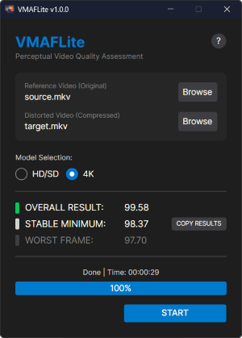

# VMAFLite

**VMAFLite** is a lightweight, portable GUI tool for Perceptual Video Quality Assessment. It leverages the power of Netflix's **VMAF** (Video Multi-Method Assessment Fusion) metric to mathematically compare the visual quality of a compressed video against its original source.

Designed for efficiency, VMAFLite works entirely in memory using pipes, eliminating the need for creating heavy raw temporary files on your disk.

## 🚀 Key Features

* **Smart Drag & Drop:** Simply drag files anywhere on the window. The app automatically assigns the first file as Reference and subsequent files as Distorted.
* **Efficient Processing:** Direct memory piping prevents SSD wear and speeds up analysis by avoiding raw file generation.
* **Auto-Crop Detection:** Correctly calculates scores even if the distorted file has been cropped (e.g., black bars removed).
* **HDR Support:** Fully supports High Dynamic Range (HDR) video sources.
* **Smart Model Switching:** Automatically detects video resolution to switch between HD/SD and 4K models.
* **Color-Coded Results:** Instantly identify quality tiers.

## 🧠 Why "NEG" Models?

VMAFLite utilizes the `vmaf_v0.6.1neg` (Negative) models instead of the standard legacy models.
* **Why?** Standard VMAF models can sometimes be "tricked" by sharpening filters, giving a high score to video that actually looks fake or grainy.
* **The Solution:** The "NEG" models are trained to penalize these artifacts. They provide a strictly honest assessment of compression fidelity, ensuring that a high score truly means the video looks like the source.

## 📊 Understanding the Scores

| Score Range | Quality Rating |
| :--- | :--- |
| **95 - 100** | Pristine (Indistinguishable) |
| **93 - 95** | Excellent |
| **85 - 93** | Good (Streaming/Web) |
| **< 85** | Poor (Visible Artifacts) |

## 💻 Compatibility

* **OS:** Windows 10 (Version 1607+) and Windows 11.
* **Architecture:** 64-bit (x64) only.
* **Note:** This application handles high-performance video processing and is not supported on 32-bit systems.

## 🛠 Technologies Used

* **Language:** C# (.NET 10)
* **Framework:** Avalonia UI (Modern, Cross-platform XAML)
* **Architecture:** MVVM (Model-View-ViewModel)

## ⚖️ Legal & Credits

**VMAFLite Source Code:**
All rights reserved. You may view the source code for educational purposes, but you are not permitted to modify, distribute, or sell this software without explicit permission from the author.

**Core Engine:**
* **FFmpeg:** This application bundles a custom build of [FFmpeg](http://ffmpeg.org) licensed under the LGPLv2.1.
* **VMAF:** Copyright Netflix, Inc. (BSD-2-Clause + Patent License).

## 👨‍💻 Author

**Rustam Shukurov**

---
*If you find this tool useful, please give it a star ⭐ on GitHub!*
